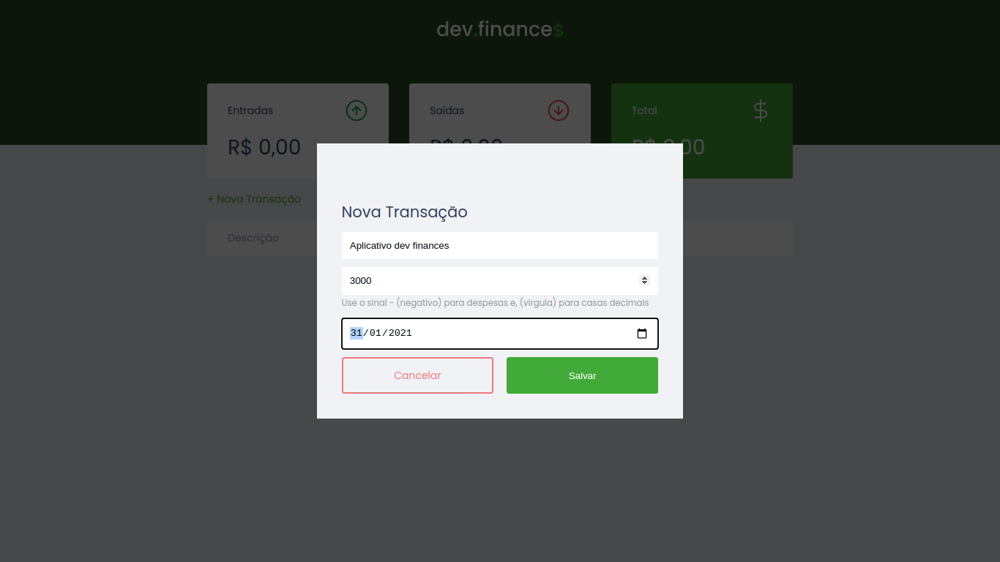
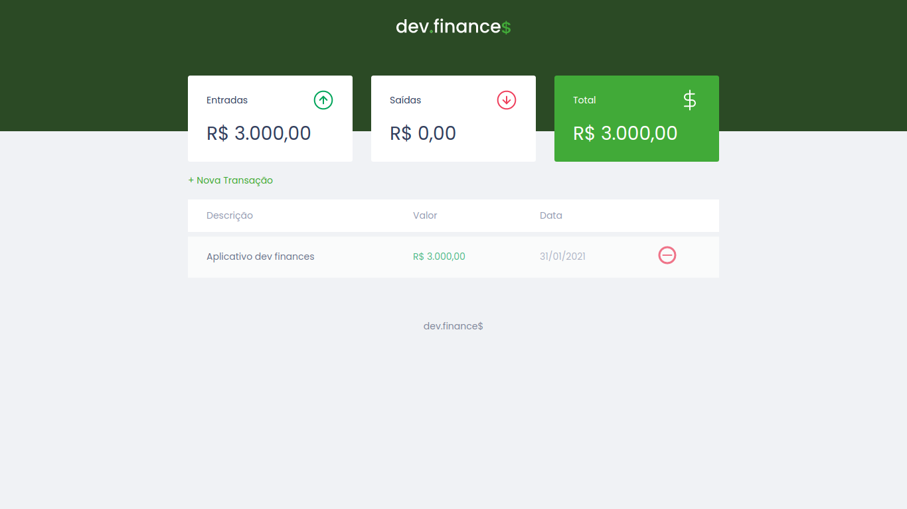
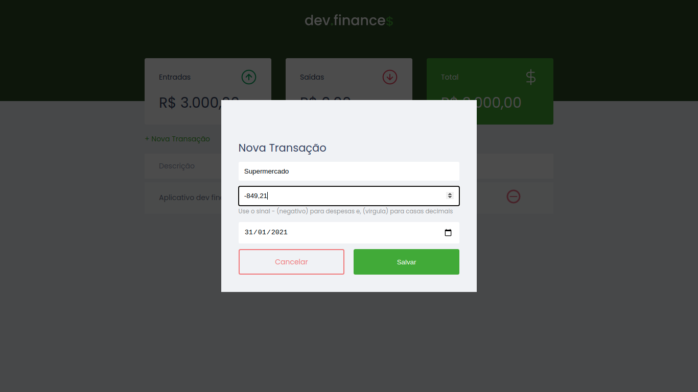
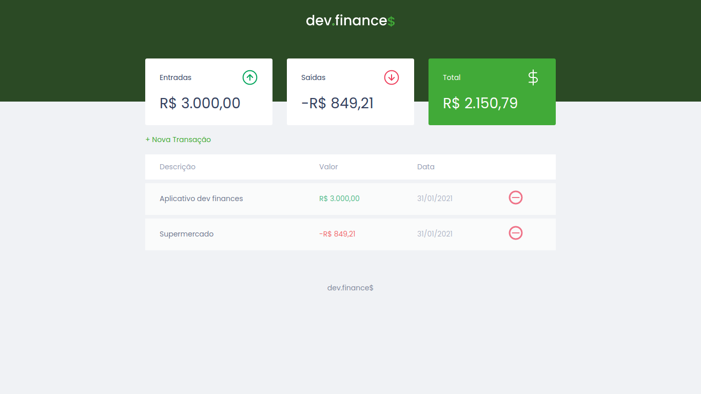

# dev_finances

dev.finance$ foi criado para gerenciar finanças e fazer o balanceio de capital.
O desenvolvimento da aplicação foi fruto da MaratonaDiscover, evento 100% gratuito organizado pela :rocket: [Rocketseat](https://github.com/Rocketseat)

:heavy_check_mark: Adicionando transação positiva

  
  
  

:x: Adicionando transação negativa

  
  

